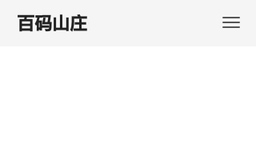
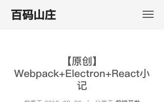

## 网页截图服务

### 示例


### 示例代码

```
http://49.233.2.233:3002/crop?src=https%3A%2F%2Fjd.com&renderWidth=1000&width=1000
```

### 完整参数说明

* `src<String>`: 必选，截图的页面地址(encodeURIComponent)，例：`http%3A%2F%2Fseejs.me`
* `fullscreen<Boolean>`: 是否整页截图。**当启用该参数时，`x`, `y`, `width`, `height`四个参数无效**
* `renderWidth<Number>`: 截图时的窗口宽度，因为不同宽度窗口宽度，前端页面的布局样式会不一样，因此该参数应尽量设置为预览页面时的窗口宽度，默认值：1366。
* `x<Number>`: 截图区域的起始点横坐标，相对于窗口左上角，默认值：0。
* `y<Number>`: 截图区域的起始点纵坐标，相对于窗口左上角，默认值：0。
* `width<Number>`: 截取的图片宽度，默认值：640。
* `height<Number>`: 截取的图片高度，默认值：640。
* `holdTime<Number>`: 页面加载完成直到截图的间隔时间，单位秒。因为前端页面内容有可能由JS渲染，并伴随一些CSS3淡入淡出动效，例如：[百码山庄](http://newjs.vip)首页的渐变。使用该参数可保证内容显示完成后再截图，确保截到有效内容。对比示例如下：
     
